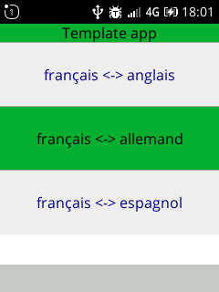

# KaiOs application template
Contains :
- `KAI` object : to build a KaiOs application as a state machine.
- Fontawesome 5 fonts.
- mustache 4.2.0
- jquery 3.5.1

# `KAI` object
Contained in `/KAI/KAI.js` file. It contains all what is necessary to build a KaiOs application as a state machine.
- the user's HTML will be written in the `index.html` file in the `div` whose `id` is `app`.
- the user's javascript will be written in the `app.js` file.

## KAI state machine
The states of the application can be defined using the method `KAI.addState(stateName,stateObject);`.
- the `stateName` is a string defining the state,
- the `stateObject` describes the state with the following properties :
  - `softKeys` : object describing the value of the 3 softkeys for that state for each supported languages.
  - `display` : object describing the htlm selectors to display for that state (boolean `true`) or to hide (boolean `false`).
  - `afterStateChange`: function that will be executed after state change to that state.
  - `events` : object describing for each event the function to execute if that event is received in that state. Currently supported events are :
    - `keyup.ArrowLeft`,
    - `keyup.ArrowRight`,
    - `keyup.ArrowUp`,
    - `keyup.ArrowDown`,
    - `keyup.SoftLeft` (= `keyup.Home` on PC browser),
    - `keyup.Enter`,
    - `keyup.SoftRight` (= `keyup.End` on PC browser),
    - `keyup.Backspace`,
    - `keyup.Default` : any other key on keybord : letter, symbol, number...
    - `window.blur` : the application was "closed" (but still running in background),
    - `window.focus` : the application was launched for the first time or re-launched,


To change the state to a specific change, simply call `KAI.newState(stateName);`. This will automatically :
- set te state to the new value,
- display the right softkeys for that new state,
- hide/show the right HTML parts,
- run the right callback,
- be ready to run a function for the relevant events only.

## `KAI.choiceList` object
This object is contained in `/KAI/KAI_choiceList.js` file). This object is used to build KaiOs choice list to choose an item.

Here is an example to create a `KAI.choiceList` that will give the following result :

  

```
const dictionnariesList = [
	{
      value:"frgb",
      choiceList_type:"NONE",
      choiceList_label:'français <-> anglais'
	},
    {
      value:"frde",
      choiceList_type:"NONE",
      choiceList_label:'français <-> allemand'
	},
    {
      value:"fres",
      choiceList_type:"NONE",
      choiceList_label:'français <-> espagnol'
	}
];

let dictionnariesListOptions = {
	"selectedItemIdPrefix" :       "dictionnariesListOptions",
	"targetDomSelector" : 		 "#dictionnariesList"
}

const dictionnaries = new KAI.choiceList(dictionnariesList,dictionnariesListOptions);
```

Then you can render HTML : `dictionnaries.generateHtml();`

And create events in the state machine to change up and down the selected item of the list and use the selected item :
```
events : {
  'keyup.ArrowUp': function(event) {
    dictionnaries.previous();
  },
  'keyup.ArrowDown': function(event) {
    dictionnaries.next();
  },
  'keyup.Enter': function(event) {
    const currentDictionnary = dictionnaries.currentItem().value;
    ...
  }
}
```

choiceList_itemNumbered:"DOWN" "UP"


## `KAI.spinner` object
The `KAI.spinner` object has 2 methods :
- `KAI.spinner.on(text)` : overlays the application with a rotating spinner optionnaly an explanation text if `text` is provided. It is used to indicate a waiting state to the user. The `text` parameter may contain HTML.
- `KAI.spinner.off()` : remove the spinner overlay.

Nb : the spinner do not change the state of the application, the keyboard or other events are thus active as in the current state. If you want to disable the keyboard or other events, you need to do go to a specific state you have to define.

TBD :
- make spinner hidden on startup without user code.

## `KAI.toastr` object

# Screen layout
The KaiOs screen has a definition of 240x320 pixels.

A KaiOs app has the following layout (from top to bottom) :
- KaiOs status (notifications, battery, time ...) : height is 25 px.
- the appTitle : height 20 px.
- the application zone : the remaining height.
- the softkeys zone : height : 30 px.

To change the screen orientation, you can use the Manifest : ``"orientation": "landscape"``

To hide the status bar, you need to use the Manifest : `"fullscreen": "true"`

See Manifest documentation for more informations.

To change dynamically the screen orientation and to hide and/or show the application title, you can use :

```
setAppLayout({
  KAI_displayOrientation :  "portrait", // 'portait' or 'landscape'
  KAI_displayAppTitle:      true        // true or false
});
```

The screen height of the `KAI_app` div is thus automatically calculated and will take the following values :

- `KAI_portrait-status-appTitle`  application zone height : 245
 px
- `KAI_portrait-status-noAppTitle`  application zone height : 265
 px
- `KAI_portrait-noStatus-appTitle`  application zone height : 270
 px
- `KAI_portrait-noStatus-noAppTitle`  application zone height : 290
 px
- `KAI_landscape-status-appTitle`  application zone height : 165
px
- `KAI_landscape-status-noAppTitle`  application zone height : 185
 px
- `KAI_landscape-noStatus-appTitle`  application zone height : 190
 px
- `KAI_landscape-noStatus-noAppTitle`  application zone height : 210
 px

 # REFERENCE
 ## OPTIONS
 ## METHODS
 ## EVENTS

 # TBD

 - Enlever les fonctions globales de mustache
